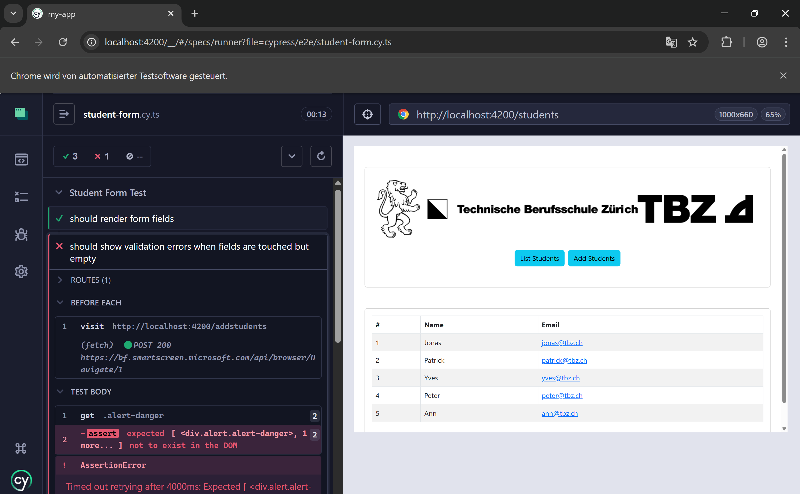

# Backend automatisiert testen

## Lösung automatisierte Backend-Tests mit Mockito

### Ehrlich gesagt war ich zu lange an dieser Aufgabe und Albaraa hat nicht migeholfen, weswegen ich den einen Fehler gelassen habe
### Ausserdem ist der Ordner zu gross um ebenfalls im Git zu sein, deswegen nur das einzelne Test-File